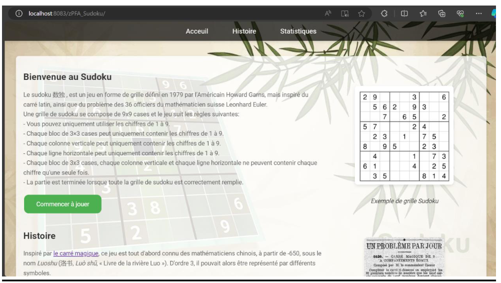
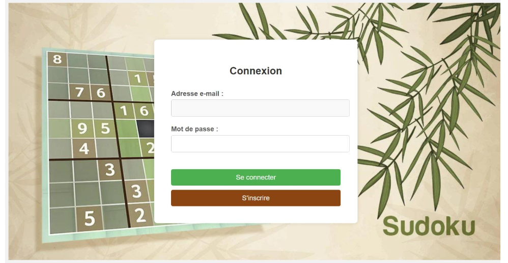
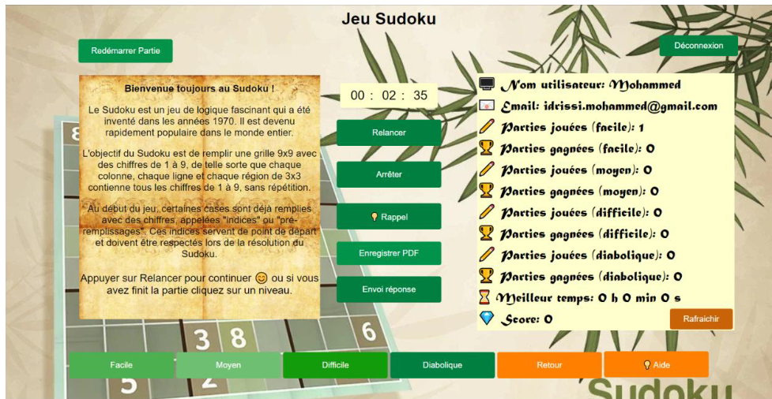

# Application Web Sudoku

This repository contains a first-year university project built to get familiar with Java EE (Servlets & WebSockets) and web application development. The goal was to implement a playable web-based Sudoku application with user authentication, score tracking, and a simple game interface.

## Quick summary

- Project type: Educational / First-year Java EE project
- Main purpose: Learn Java Servlets, WebSockets, and building a simple webapp
- Main languages & technologies: Java, Java EE (Servlets, WebSockets), HTML, CSS, JavaScript, jQuery

## Technologies used

- Java (Servlets): server-side endpoints and authentication logic are implemented as servlets under `src/main/java/`.
- Java WebSockets: real-time communication and score updates use Java WebSocket endpoints.
- HTML, CSS, JavaScript: UI pages located in `src/main/webapp` include `index.html`, `Page_Acceuil.html`, `login.html`, `Register.html`, and front-end script `sudoku.js`.
- jQuery: used on the client side (`jquery-3.7.1.js`) for DOM manipulation and AJAX.
- Hashing utility: a small hashing helper is included under `src/main/java/hashing/` for password hashing.
- Deployment target: a Java EE servlet container (Apache Tomcat or similar).

## Project structure (high level)

- `src/main/java/` - Java source files (Servlets, WebSockets, helpers)
- `src/main/webapp/` - Web content (HTML, CSS, JS, WEB-INF)
- `images/` - Application screenshots used in this README
- `build/` - compiled classes (if prebuilt)

## Screenshots

Home / main page

Home with story/history view

Authentication (login/register)

Game interface

## How to run / deploy

You can run this web application on a Java EE compatible servlet container such as Apache Tomcat. Below are two common ways to run it.

Option A — Recommended: Use an IDE (Eclipse / IntelliJ)

1. Import the project as a Dynamic Web Project or Maven/Gradle project (if you add a build file).
2. Configure an Apache Tomcat server in your IDE.
3. Add the project to the server and start the server.
4. Open your browser to http://localhost:8080/<context>/index.html or `Page_Acceuil.html`.

Option B — Manual deploy to Tomcat (quick)

1. Build a WAR from `src/main/webapp` (ensure compiled classes are in `WEB-INF/classes` or package compiled classes into `WEB-INF/lib` as needed).
2. Copy the WAR file to Tomcat's `webapps` folder and start Tomcat.
3. Access the app at http://localhost:8080/<your-war-name>/index.html

Example (basic jar-based WAR creation; adjust paths to your JDK/Tomcat):

Powershell (from project root, requires `jar` on PATH):

    cd .\src\main\webapp
    jar -cvf ..\..\sudoku.war *

Then copy `sudoku.war` to `C:\path\to\tomcat\webapps` and start Tomcat.

Notes:
- If you don't have a build script, using an IDE is the fastest way to get started.
- Ensure your Java version matches the project's compiled classes (JDK 8+ recommended for typical Java EE student projects).

## What you can explore in the code

- `Login_Register_Puzzles/Servlet_Login.java` and `Servlet_Register.java` — authentication endpoints.
- `websockets/` — WebSocket endpoints that push real-time updates (scoreboard, user statistics).
- `hashing/hashing_class.java` — small helper for password hashing.
- `sudoku.js` — client-side game logic.

## Limitations & notes

- This was a learning project — security is basic. If you plan to extend it, consider:
  - Using a secure hashing algorithm and salts (e.g., bcrypt/Argon2) instead of home-grown hashing.
  - Adding CSRF protection, input validation, and HTTPS deployment.

